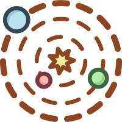

# Welcome

 

> 知识的海岛越大，无知的海岸越长

- 这里是CoolCode个人知识库，旨在记录学习、工作过程中遇到的问题、总结的经验以及常用的技巧与工具。

- 本站大部分内容来自互联网，如有侵权行为请在GitHub反馈[issue](https://github.com/maker-dong/maker-dong.github.io/issues)，我会第一时间处理。

- 个人博客[CoolCodeBlog](https://www.coolcode.fun/)欢迎大家来访，相比于知识库，博客中的文章更具概括性，是对知识库中零碎知识点的总结归纳。

- 特别感谢神奇的文档网站生成器[docsify](https://docsify.js.org/)提供的技术支持，以及GitHub提供的免费仓库与Pages页面。
